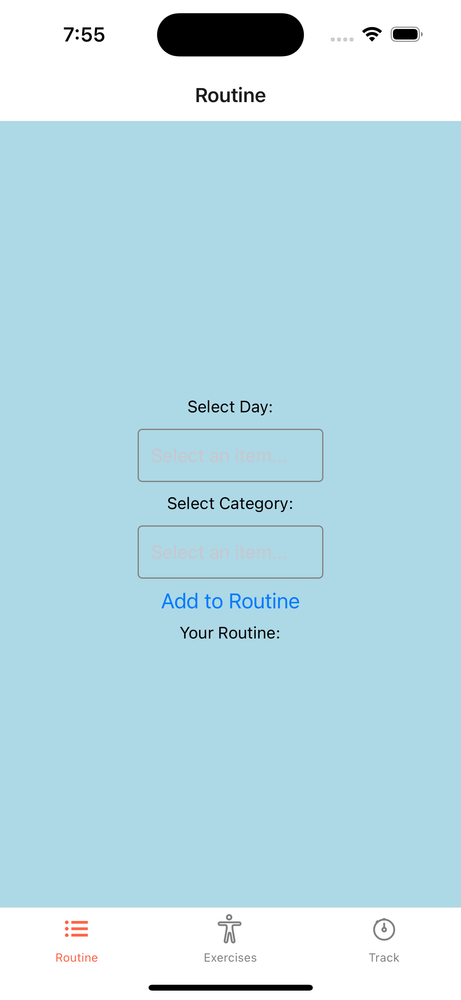
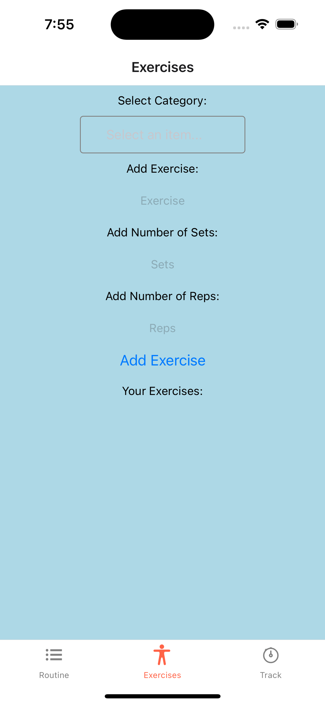
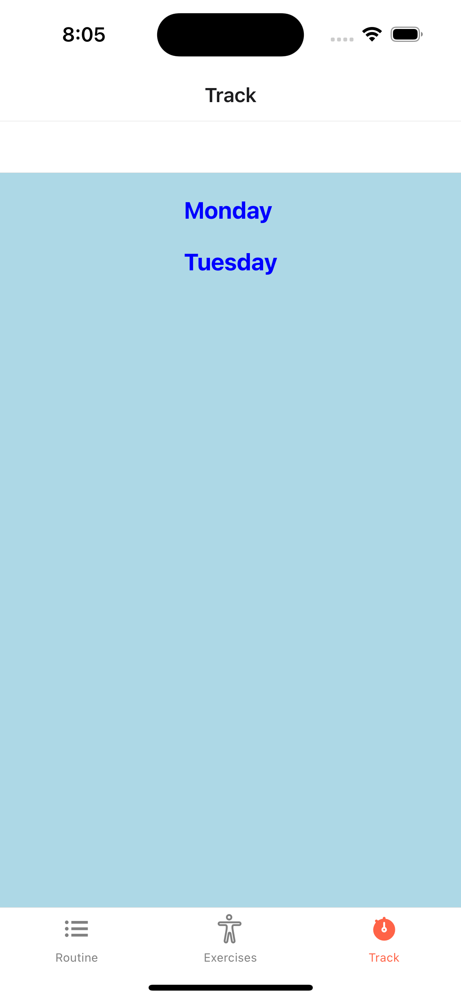

# Gym App

## Description

This is a simple Gym App created using React Native and Redux. The app allows users to create routines and track their progress for different exercises. It also includes a list of exercises grouped by category, as well as the ability to add new exercises.

## Features

- Create Routines for different days
- Track progress for different exercises
- Add Exercises grouped by category
- Select exercises from a pre-populated list

## Skills and Stacks Used

- React Native
- Redux
- Expo
- React Navigation
- React Native Elements
- React Native Linear Gradient
- React Native Safe Area Context
- React Native Picker Select

## Installation

To get started with the app, follow these steps:

1. Clone this repository to your local machine.
2. Navigate to the root directory of the project and run `npm install` or `yarn` to install the project dependencies.
3. Run `expo start` to start the development server.
4. You can now run the app on your Android or iOS device or emulator.

## Screenshots

## Future Improvements

- Ability to track progress for each set
- Ability to add images for each exercise
- Social Sharing features

## Credits

- This app was created by Ayush Jain as part of the ACS project.
